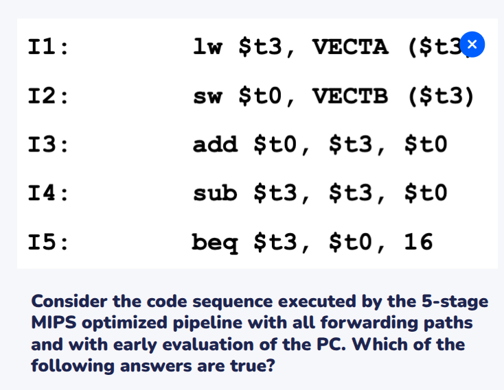
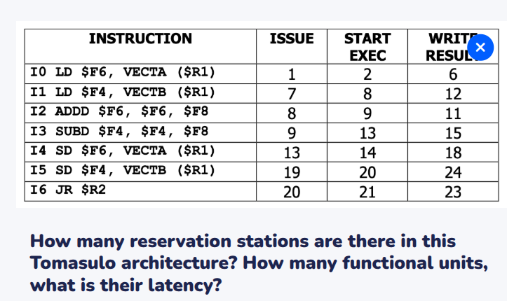

# Exercise session
## Question 1
### Point 1
1. -
2. WAR on X[i]
3. RAW on Y[i]
4. RAW, WAW, WAR on Y[i]
### Point 2
We should avoid changing other things with register renaming.\
However, final register state can be different.
1. Y1 instad of Y
2. X1 instead of l.h.s. X
3. Y1 instead of Y
4. Y1 instead of Y
## Question 2
Essentially, we would move SD to the end of the loop.\
The point of moving the SD after the BNEZ is not to lose the cycle needed for evaluating BNEZ.\
With branch delay slot, we can always put it afterwards, be the branch taken or not: it always gets executed.\
We cannot leave the instruction unaltered because the R1 register is changed. Writing\
SD $F2, 8($R1)\
we get the exact same behaviour. 

## WooClap 1

Some dependencies:
1. -
2. RAW t3
3. RAW t3
4. RAW t0, t3
5. RAW t3, t0
We need to forward the results of the MEM stage of I1 to the EX stage of I2, so we need a bubble there.\
The other stall is needed for the EX to ID forwarding of t3.\
In case there is no early evaluation, no stall is needed, as the EX to EX forwarding path would provide the content of t3.
## WooClap 2

From the issue stage, we can infer the number of r.s.\
IMPORTANT: # R.S. >= # F. U. 
From the start exec stage, we can infer the number of functional units. However, in this case, the number of ALU/branch cannot be properly inferred because there could be more than one (which is not properly employed as I3 needs to wait for I1 to write).
## Exercise 2(H) - Tomasulo
1. NT 1 2 4 - RS3 ALU/BR1 t6 t7 -
2. - 2 3 11 data cache miss RS1 load/store1 VECTA t6 - 
3. - 3 4 12 data cache miss RS2 load/store2 VECTb t6 -
4. - 4 13 15 raw RS4 alu/br2 rs1 rs2 -
5. - 12 16 20 structural hazard + raw RS1 load/store1 VECTC t6 rs4
6. - 13 14 16 - rs3 alu/br1 t6 4 - 
7. T 16 17 19 struct hazard rs4 rs4 alu/br2 for - -

There is no contention between I5 and I6 at cycle 16, because Tomasulo takes care of all RF hazards with renaming. The only contentions that should be taken care of are about RS, bus and FU.

## Exercise 1 - Scoreboard
### Question 2
1. -
2. -
3. 3 7 11 12 RAW f2, f4 FPU1    [read at cycle 7 instead of 8 because of forwarding]
4. 7 12 15 16 struct hazard LDU1, RAW f4 LDU1
5. 8 9 10 13 WAR HAZARD on r1 ALU 1
6. 9 10 11 14 STRUCT WP ALU2
7. 14 15 16 17  Struct hazard ALU1 [note that we write even here]

CPI: 17/7 = 2.42